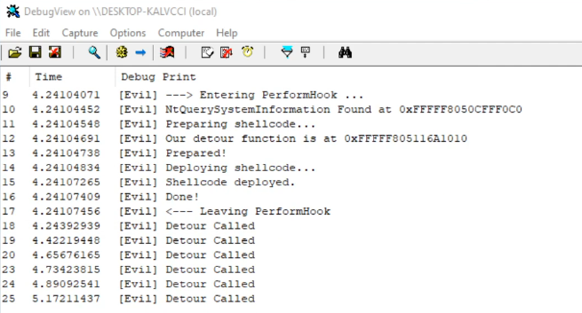

# EvilHooker
Function hooks in Windows kernel

# Overview

This kernel mode driver executes inline-hooking against kernel function.  
In this case the driver hooks `NtQuerySystemInformation` and since the driver does not care about its original functionalities  
and the implementation of its function is an empty, it causes the operating system crash.  
That also means it has a high possibility that this could be result in critical damage to the system.

So please do not run this code in your main.  
if you are going to execute this, prepare your dedicated virtual machine, with the test mode.

# Reference(s)

Well explained concept is here.  
https://xtech.nikkei.com/it/article/COLUMN/20070928/283226/
